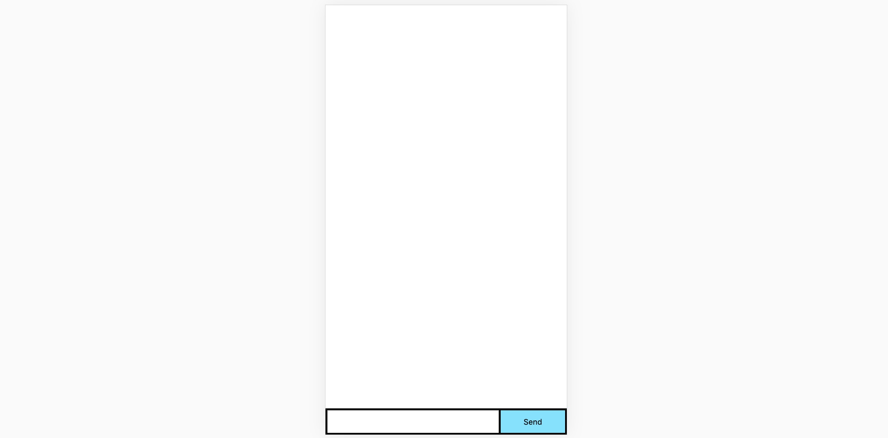
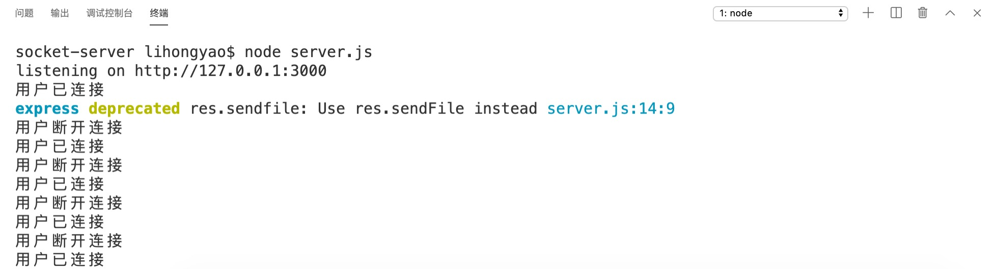

提示：由于开发环境下， socket.io 会自动提供客户端。所以我们只需要安装一个socket.io模块即可。

# 一、基本使用

## 1. 创建配置文件

```shell
# NPM
$ npm init -y
# YARN
$ yarn init -y
```

## 2. 安装模块

```shell
# NPM
$ npm install express socket.io
# YARN
$ yarn add express socket.io
```

## 3. 构建服务

*server.js*

```js
// 1. 获取express模块实例
const app = require("express")();
// 2. 将express模块实例作为回调构建http模块实例
const http = require("http").Server(app);
// 3. 将http模块实例作为回调构建socket.io模块实例
const io = require("socket.io")(http);
// 4. 使用http模块开启后端服务（原生node+express的结合）
http.listen(3000, () => {
    console.log('listening on http://127.0.0.1:3000');
});
// 5. 定义接口
app.get("/", (req, res) => {
    // 将根目录下的index.html发送到前端
    res.sendfile(__dirname + "/index.html");
});

// 6. 监听前端的socket请求连接（前端每次执行一次io()方法就会发起一次socket请求）
io.on("connection", socket => {
    console.log("用户已连接！");
    // 断开请求
    socket.on("disconnect", () => {
        console.log("用户断开连接！");
    })
});
```

## 4. 构建客户端

*index.html*

```html
<!DOCTYPE html>
<html lang="zh-CN">

<head>
    <meta charset="UTF-8">
    <meta name="viewport" content="width=device-width, initial-scale=1.0">
    <meta http-equiv="X-UA-Compatible" content="ie=edge">
    <title>Socket.IO chat</title>
    <style>
        * { margin: 0; padding: 0; box-sizing: border-box; }
        form { width: 100%; background: #000; padding: 3px; position: fixed; bottom: 0; display: flex; justify-content: space-between; }
        form input { border: 0; padding: 10px; width: calc(100% - 103px); }
        form button { width: 100px; background: rgb(130, 224, 255); border: none; padding: 10px 0; }
        #messages { list-style-type: none; }
        #messages li { padding: 5px 10px; }
        #messages li:nth-child(odd) { background: #eee; }
    </style>
</head>

<body>
    <ul id="messages"></ul>
    <form action="">
        <input autocomplete="off" />
        <button>Send</button>
    </form>
    <!-- 加载 socket.io-client,socket.io-client 暴露了一个 io 全局变量，然后连接服务器。 -->
    <script src="/socket.io/socket.io.js"></script>
    <script>
        // 请注意我们在调用 io() 时没有指定任何 URL
        // 因为它默认将尝试连接到提供当前页面的主机。
        const socket = io();
    </script>
</body>

</html>
```

## 5. 运行效果



后端通过node serve开启服务后，由于socket.io把http实例作为了回调，所以前端每执行一次io()方法，就会触发一次socket请求。后端就会弹出相应的日志：



# 二、前后端通信

## 1. 发送消息

方法：socket.emit(flag, message);

提示：客户端和服务端都是使用emit方法发送消息。

## 2. 接收消息

方法：socket.on(flag, callback);

提示：客户端和服务端都是使用on方法发送消息。

## 3. 示例代码

**# 客户端**

```js
window.onload = function() {
    let socket = io();
    let send = document.querySelector("button");
    let input = document.querySelector("input");
    let list = document.querySelector("#messages");
    // 客户端发送消息
    send.onclick = function() {
        socket.emit("chat message", input.value);
        input.value = "";
        return false;
    }
    // 客户端接收消息
    socket.on("chat message", message => {
        console.log("message：", message);
        // 将接收到的消息显示在页面中
        list.insertAdjacentHTML("beforeend", `<li>${message}</li>`)
    })
}
```

**# 服务端**

```js
io.on("connection", socket => {
    console.log("用户已连接");
    // 服务端接收消息
    socket.on("chat message", message => {
        console.log("message：", message);
        // 服务端发送消息
        io.emit("chat message", "您好，服务端已接收到您的消息。");
    });
    // 断开请求
    socket.on("disconnect", () => {
        console.log("用户断开连接");
    })
});
```


