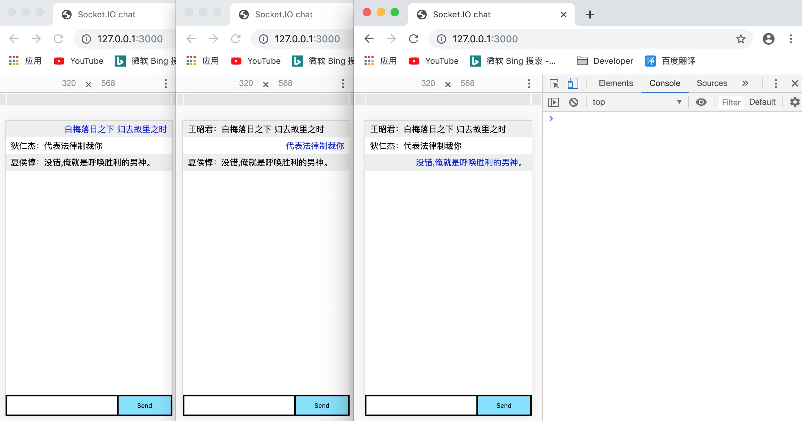
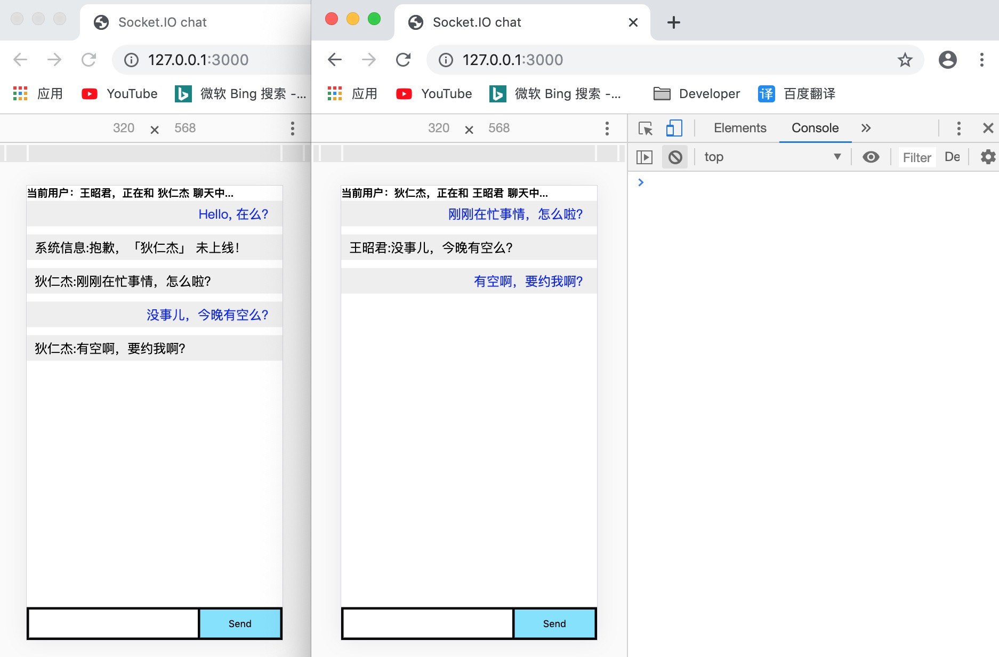

# 一、世界群聊

无差别多人聊天室实现，所有人都能收到消息。

## 1. 效果



## 2. 客户端实现

```js
window.onload = function () {
    let username = prompt("请输入您的名字");
    let socket = io();
    let send = document.querySelector("button");
    let input = document.querySelector("input");
    let list = document.querySelector("#messages");
    // 客户端发送消息
    send.onclick = function () {
        let obj = {
            username,
            message: input.value
        }
        let element = `<li style="color:blue;text-align:right;">${input.value}</li>`;
        list.insertAdjacentHTML("beforeend", element)
        socket.emit("chat message", JSON.stringify(obj));
        input.value = "";
        return false;
    }
    // 客户端接收消息
    socket.on("chat message", data => {
        let obj = JSON.parse(data);
        // 不能接收自己的消息
        if (obj.username === username) return;
        let element = `<li>${obj.username}：${obj.message}</li>`;
        list.insertAdjacentHTML("beforeend", element);
    })
}
```

## 3. 服务端实现

服务端基本不做什么处理，就是直接转发前端传来的信息。

```js
io.on("connection", socket => {
    console.log("用户已连接");
    // 服务端接收消息
    socket.on("chat message", message => {
        // 服务端发送消息
        io.emit("chat message", message);
    });
    // 断开请求
    socket.on("disconnect", () => {
        console.log("用户断开连接");
    })
});
```

这样就实现了效果图所示功能，大家可以都访问此地址，在同一个网络下我们可以通过这个程序进行聊天了。

# 二、群组聊天室 - i

## 1. 服务端

服务端需要监听每个群组请求，主要通过of方法建立单独的群组监听。

```js
// 创建法师、射手群组
const master = io.of("/master"); 
const shooter = io.of("/shooter"); 
// => 监听法师群聊
master.on("connection", socket => {
    console.log("用户已连接");
    // 服务端接收消息
    socket.on("chat message", message => {
        // 服务端发送消息
        master.emit("chat message", message);
    });
    // 断开请求
    socket.on("disconnect", () => {
        console.log("用户断开连接");
    })
});
// => 监听射手群聊
shooter.on("connection", socket => {
    console.log("用户已连接");
    // 服务端接收消息
    socket.on("chat message", message => {
        // 服务端发送消息
        shooter.emit("chat message", message);
    });
    // 断开请求
    socket.on("disconnect", () => {
        console.log("用户断开连接");
    })
});
```

## 2. 客户端

```typescript
// 请注意我们在调用 io() 时没有指定任何 URL
// 因为它默认将尝试连接到提供当前页面的主机。
window.onload = function () {
    let username = prompt("请输入您的名字");
    let groupname = prompt("请输入您要加入的群组名");
    // => 动态的链接不同群
    let socket = io(`http://127.0.0.1:3000/${groupname}`);
    let send = document.querySelector("button");
    let input = document.querySelector("input");
    let list = document.querySelector("#messages");
    // 客户端发送消息
    send.onclick = function () {
        let obj = {
            username,
            message: input.value
        }
        let element = `<li style="color:blue;text-align:right;">${input.value}</li>`;
        list.insertAdjacentHTML("beforeend", element)
        socket.emit("chat message", JSON.stringify(obj));
        input.value = "";
        return false;
    }
    // 客户端接收消息
    socket.on("chat message", data => {
        let obj = JSON.parse(data);
        // 不能接收自己的消息
        if (obj.username === username) return;
        let element = `<li>${obj.username}：${obj.message}</li>`;
        list.insertAdjacentHTML("beforeend", element);
    })
}
```

# 三、群组聊天室 - ii

群组聊天另一种实现形式，使用分组。

## 1. 概述

关于分组，还有种做法就是：客户端并不需要直接就链接对应分组的服务端地址，而是只连接基本的根地址。然后在服务端也只监听根地址的链接，而不需要直接监听对应的分组。

服务端在根地址的监听里面实现通过相关api显示的把当前用户加入某分组进行管理：

- socket.io.rooms：保存各个分组的数组

- socket.io.join()：负责添加用户进入组

- socket.io.leave()：负责从组删除用户

- socket.io.to()：负责找到该组别

- socket.io.in()：在指定的房间中，为房间中的所有的socket发送消息。

## 2. 服务端

```js
// 1. 获取express模块实例
const app = require("express")();
// 2. 将express模块实例作为回调构建http模块实例
const http = require("http").Server(app);
// 3. 将http模块实例作为回调构建socket.io模块实例
const io = require("socket.io")(http);
// 4. 使用http模块开启后端服务（原生node+express的结合）
http.listen(3000, () => {
    console.log('listening on http://127.0.0.1:3000');
});
// 5. 定义接口
app.get("/", (req, res) => {
    // 将根目录下的index.html发送到前端
    res.sendfile(__dirname + "/index.html");
});
// 6. socket.io 逻辑
io.on("connection", socket => {
    // 加入群聊1
    socket.on('addgroup1', () => {
        // 添加用户进入用户组group1
        socket.join('group1', () => {
            // 构造系统消息
            let data = { username: '系统', msg: '新用户加入' }
            // 找到对应组并发送系统消息
            socket.to('group1').emit('receiveMsg', data);
            // 输出所有分组
            console.log(Object.keys(socket.rooms))
        })
    });
    // 加入群聊2
    socket.on('addgroup2', () => {
        // 添加用户进入用户组group2
        socket.join('group2', () => {
            // 构造系统消息
            let data = { username: '系统', msg: '新用户加入' }
             // 找到对应组并发送系统消息
            socket.to('group2').emit('receiveMsg', data)
            // 输出所有分组
            console.log(Object.keys(socket.rooms))
        })
    })
    // 发送世界消息
    socket.on('sendMsg', data => {
        io.emit('receiveMsg', data)
    })
    // 发送群组消息
    socket.on('sendToOurGroup', data => {
        let groups = Object.keys(socket.rooms)
        console.log(groups);
        for (let i = 1; i <= groups.length; i++) {
            socket.to(groups[i]).emit('receiveMsg', data)
        }
        socket.emit('receiveMsg', data)
    })
});

```

## 3. 客户端

```js
<!DOCTYPE html>
<html lang="zh-CN">
<head>
    <meta charset="UTF-8">
    <meta name="viewport" content="width=device-width, initial-scale=1.0">
    <meta http-equiv="X-UA-Compatible" content="ie=edge">
    <title>Socket.IO chat</title>
</head>

<body>

    <div style="float: left; width: 30%">
        <button onclick="group1()">加入Group1</button>
        <button onclick="group2()">加入Group2</button>
        <hr>
        群聊：<input type="text" id="msginput" style="border:1px solid #eee;">
        <button type="button" id="sendmsg">发给世界用户</button>
        <button type="button" id="sendtoourgroup">发给本组用户</button>
    </div>
    <div style="float: left; width: 60%" id="chatbox"></div>
</body>
<script src="/socket.io/socket.io.js"></script>
<script>
    let username = prompt("请输入用户名");
    let socket = io.connect('http://localhost:3000');
    // 加入聊天组
    let group1 = (username) => {
        socket.emit('addgroup1');
    };
    let group2 = (username) => {
        socket.emit('addgroup2');
    };
    // 获取聊天输入框
    let msgInput = document.getElementById('msginput');
    // 发送世界消息
    let btn1 = document.getElementById('sendmsg');
    btn1.addEventListener('click', () => {
        let msg = msgInput.value;
        let data = { username, msg };
        socket.emit('sendMsg', data);
    });
    // 发送群组发送
    let btn2 = document.getElementById('sendtoourgroup');
    btn2.addEventListener('click', () => {
        let msg = msgInput.value;
        let data = { username, msg };
        socket.emit('sendToOurGroup', data);
    })
    // 接收消息
    let chatBox = document.getElementById('chatbox');
    socket.on('receiveMsg', (data) => {
        chatBox.insertAdjacentHTML("beforeend",`<div>${data.username}: ${data.msg}</div>`);
    });
    
</script>
</body>

</html>
```

# 四、私聊聊天室

## 1. 实现思路

当用户连接上服务器时，就把此用户保存在一个对象中，以用户名为键（用户名值不应该给汉字，除非做转码处理），以socket.id为值。然后用户a要给用户b发消息时，在后端通过b的用户名找到b的socket的id, 从而将用户a的消息发给b. b发消息给a也是一样的方式。

## 2. 提示

在实现私人聊天时应该注意如下事项：

1．各种变量属性等命名时尽量给上一个独特的后缀，以避免和其他名字冲突从而出现bug.

2．在这里使用socket.io返回数据时，名字尽量不要出现username,否则可能会出现异常。在使用socket.io做事件监听时，事件名不要写成connect,会发生冲突。

3．对象的键不应该给汉字，否则在很多时候都会出现异常。

## 3. 效果



##4. 方法

发给指定用户的方法：socketio.to(socketID)

## 5. 服务端

```js
// 1. 获取express模块实例
const app = require("express")();
// 2. 将express模块实例作为回调构建http模块实例
const http = require("http").Server(app);
// 3. 将http模块实例作为回调构建socket.io模块实例
const io = require("socket.io")(http);
// 4. 使用http模块开启后端服务（原生node+express的结合）
http.listen(3000, () => {
    console.log("listening on http://127.0.0.1:3000");
});
// 5. 定义接口
app.get("/", (req, res) => {
    // 将根目录下的index.html发送到前端
    res.sendfile(__dirname + "/index.html");
});
// 6. socket.io 逻辑
// 保存所有用户的键值对集合
let users = {};
io.on("connection", socket => {
    // 接收连接请求
    socket.on("con", data => {
        let obj = JSON.parse(data) // 获取连接的用户信息
        users[obj.username] = socket.id; // 将当前用户名和对应的链接id进行保存
        console.log("有新的链接, 最新用户集合为：", users);
    })
    // 接收客户端发来的数据
    socket.on("chat message", data => {
        let obj = JSON.parse(data) // 获取连接的用户信息
        console.log("obj:", obj);
        // 判断目标用户是否存在
        if (!users[obj.toWho]) {
            io.to(socket.id).emit("receiveMessage", JSON.stringify({
                username: "系统信息",
                message: `抱歉，「${obj.toWho}」 未上线！`
            })); 
        } else { 
            // 通过id将信息转发给指定的对象
            io.to(users[obj.toWho]).emit("receiveMessage", JSON.stringify({
                username:obj.username,
                message: obj.message
            })); 
        }
    })
    // 如果是断开socket请求，就会触发下面的代码
    socket.on("disconnect", () => {
        console.log("用户不在线！");
    })
})

```

##6. 客户端

```html
<!DOCTYPE html>
<html lang="zh-CN">
<head>
    <meta charset="UTF-8">
    <meta name="viewport" content="width=device-width, initial-scale=1.0">
    <meta http-equiv="X-UA-Compatible" content="ie=edge">
    <title>Socket.IO chat</title>
    <style>
        * { margin: 0; padding: 0; box-sizing: border-box; }
        form { width: 100%; background: #000; padding: 3px; position: fixed; bottom: 0; display: flex; justify-content: space-between; }
        form input { border: 0; padding: 10px; width: calc(100% - 103px); }
        form button { width: 100px; background: rgb(130, 224, 255); border: none; padding: 10px 0; }
        #messages { list-style-type: none; }
        #messages li { padding: 5px 10px; }
        #messages li:nth-child(odd) { background: #eee; }
    </style>
</head>

<body>
    <h1 class="title"></h1>
    <ul id="messages"></ul>
    <form action="">
        <input autocomplete="off" />
        <button>Send</button>
    </form>
</body>
<script src="/socket.io/socket.io.js"></script>
<script>
    window.onload = function () {
        // 提示用户输入
        let username = prompt("请输入您的用户名");
        let who = prompt("您要和谁聊天?");
        // 获取元素
        let sendBtn = document.querySelector("button");
        let input = document.querySelector("input");
        let title = document.querySelector(".title");
        let message = document.querySelector("#messages");
        // 更新标题
        title.textContent = `当前用户：${username}，正在和 ${who} 聊天中...`;
        // 处理socket
        let socket = io("http://localhost:3000/");
        // 先和服务端建立连接
        let connetObj = {
            username,
            toWho: who
        }
        socket.emit("con", JSON.stringify(connetObj));
        // 发送消息
        sendBtn.onclick = function () {
            let obj = {
                username,
                toWho: who,
                message: input.value
            }
            // 发送消息
            socket.emit("chat message", JSON.stringify(obj));
            let element = `<li style="text-align:right; color:blue;">${input.value}<li>`;
            message.insertAdjacentHTML("beforeend", element);
            input.value = "";
            return false;
        }
        //接收后端发来的消息
        socket.on("receiveMessage", function (data) {
            let obj = JSON.parse(data);
            console.log(obj)
            if (obj.username == username) return; // 不接收自己发的消息
            let element = `<li>${obj.username}:${obj.message}<li>`;
            message.insertAdjacentHTML("beforeend", element);
        });
    }
</script>
</body>

</html>
```

# 五、emit 常见用法

```js
io.on('connect', socket => {
    // 只发给sender。 sending to the client
    socket.emit('hello', 'can you hear me?', 1, 2, 'abc');
    // 发给所有人，除了sender。 sending to all clients except sender
    socket.broadcast.emit('broadcast', 'hello friends!');
    // 发给game房间所有人，除了sender。 sending to all clients in 'game' room except sender
    socket.to('game').emit('nice game', "let's play a game");
    // 发给game1和/或game2所有人，除了sender。 sending to all clients in 'game1' and/or in 'game2' room, except sender
    socket.to('game1').to('game2').emit('nice game', "let's play a game (too)");
    // 发给game房间所有人，包含sender。 sending to all clients in 'game' room, including sender
    io.in('game').emit('big-announcement', 'the game will start soon');
    // 发给域名myNamespacs所有人，包含sender。 sending to all clients in namespace 'myNamespace', including sender
    io.of('myNamespace').emit('bigger-announcement', 'the tournament will start soon');
    // 发给域名myNamespace里room房间的所有人，包含sender。 sending to a specific room in a specific namespace, including sender
    io.of('myNamespace').to('room').emit('event', 'message');
    // 发给某一个人 sending to individual socketid (private message)
    io.to(`${socketId}`).emit('hey', 'I just met you');
    // WARNING: `socket.to(socket.id).emit()` will NOT work, as it will send to everyone in the room
    // named `socket.id` but the sender. Please use the classic `socket.emit()` instead.
    // sending with acknowledgement
    socket.emit('question', 'do you think so?', function (answer) { });
    // sending without compression
    socket.compress(false).emit('uncompressed', "that's rough");
    // sending a message that might be dropped if the client is not ready to receive messages
    socket.volatile.emit('maybe', 'do you really need it?');
    // specifying whether the data to send has binary data
    socket.binary(false).emit('what', 'I have no binaries!');
    // sending to all clients on this node (when using multiple nodes)
    io.local.emit('hi', 'my lovely babies');
    // sending to all connected clients
    io.emit('an event sent to all connected clients');
});
```

# 六、生产环境使用

当我们在生产环境下使用时，我们就应该单独的使用socket客户端模块了，而不是共用服务端的socket模块。

在你的客户端下载：socket.io-client

```shell
$ npm install socket.io-client 
$ yarn add socket.io-client 
```

如果你是通过模块化开发，那么你可以直接使用import或者require方法导入使用。如果你是传统的非模块化开发，就直接通过script标签导入使用即可。

```html
<!--传统非模块化导入 -->
<script src="./node_modules/socket.io/dist/socket.io.js"></script>
```

> 注意：
>
> \1. 在正式开发环境下，客户端就应该和服务端进行分离了
>
> \2. 服务端需要设置跨域


